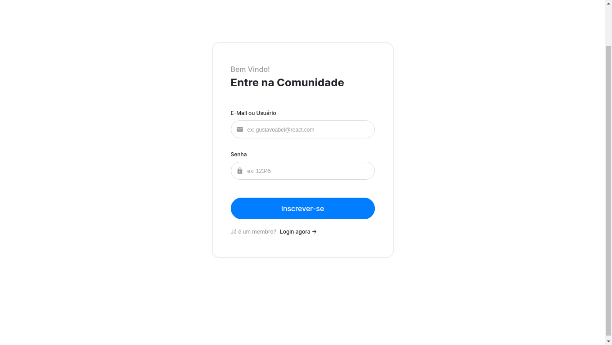

## React - Tela de login 🔑

Olá a todos! 👋

Eu queria compartilhar com vocês uma tela de login simples, este é meu esforço para aprender React.

  

## Scripts Disponíveis

No diretório do projeto, você pode executar:

### `npm start`

Execute o aplicativo no modo de desenvolvedor. 
 [http://localhost:3000](http://localhost:3000) para vê-lo no navegador.
